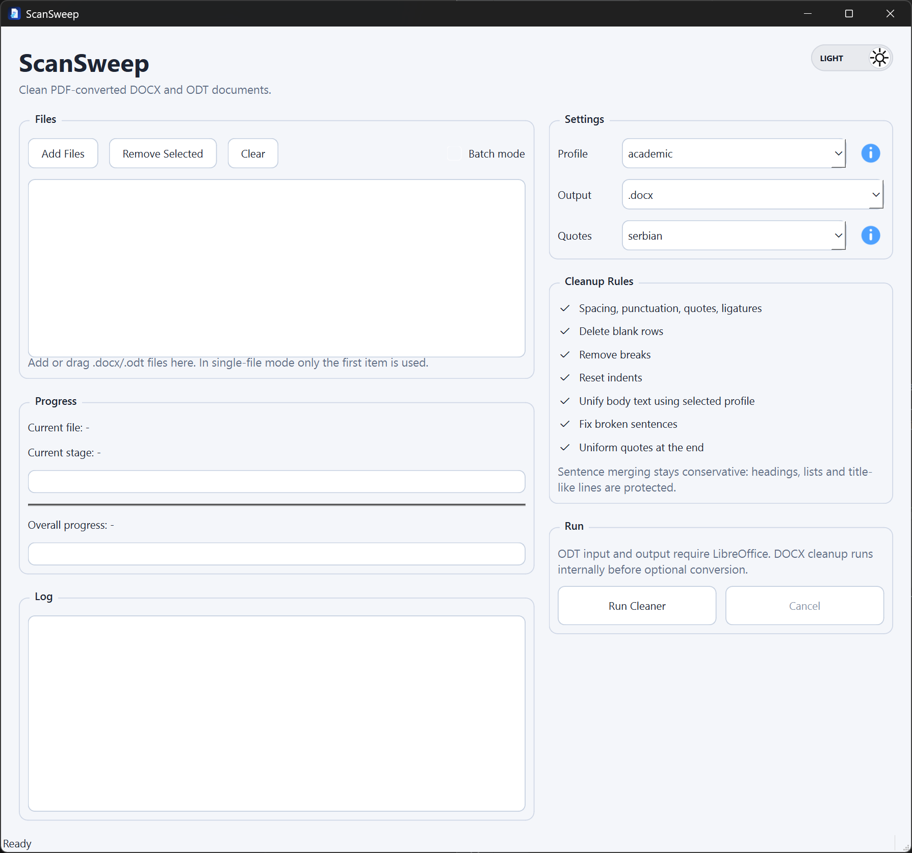

# ScanSweep

ScanSweep is a tool for cleaning `.docx` and `.odt` documents produced from PDF conversion, OCR, and low-quality scans.

It focuses on practical post-conversion cleanup:
- spacing and punctuation fixes
- quote normalization and language-specific quote styling
- OCR artifact cleanup
- broken sentence merging
- paragraph formatting by profile
- batch processing
- audit log generation
- preservation of footnotes, endnotes, and comments in `.docx`

<p style="text-align: center;">
  
</p>

## Features

- PySide6 desktop interface
- Single-file and batch processing
- Input support for `.docx` and `.odt`
- Output support for `.docx` and `.odt`
- Profiles:
  - `novel`
  - `academic`
  - `legal`
- Quote styles:
  - `english-double`
  - `english-single`
  - `serbian`
  - `german`
- Automatic `.audit.md` file saved next to each exported file

## Requirements

- Python 3.13
- LibreOffice for `.odt` input/output conversion

Python dependencies used by the app:
- `python-docx`
- `PySide6`
- `odfpy`

## Run

From the project directory:

```powershell
cmd /c .venv\Scripts\python.exe main.py
```

## Audit Log

For every processed output file, ScanSweep writes an audit log next to it:

- Output file: `document_cleaned.docx`
- Audit log: `document_cleaned.audit.md`

The audit log includes:
- input/output metadata
- enabled options
- summary counts
- selected `before -> after` examples
- notes about preserved package parts such as comments or notes

## Profiles

`novel`
- Garamond 12
- first-line indent 1 cm
- softer cleanup behavior for prose-oriented documents

`academic`
- Arial 11
- first-line indent 1 cm
- neutral general-purpose cleanup

`legal`
- Times New Roman 12
- no first-line indent
- stronger protection for structured legal numbering and clause patterns

## Notes

- `.odt` files are converted through LibreOffice before and after cleaning.
- Footnotes, endnotes, and comments are preserved for `.docx` output.
- Protected references and comment/note markers are skipped during text rewrite operations to avoid breaking links.

## License

This project is licensed under the MIT License. See [LICENSE](C:/Users/damir/PycharmProjects/CleanDOCX/LICENSE).
