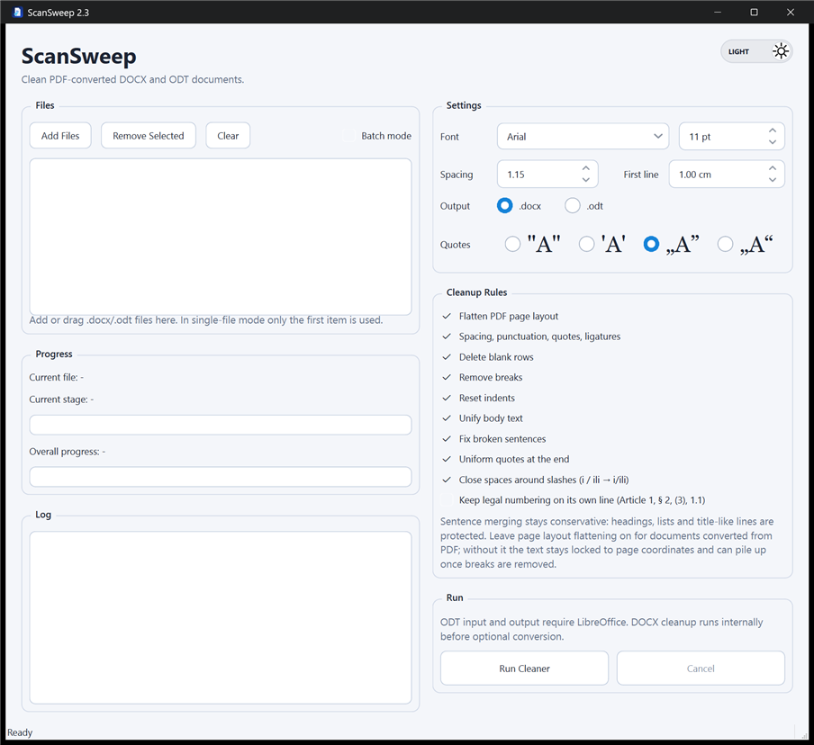

# ScanSweep

ScanSweep cleans up `.docx` and `.odt` documents that came out of a PDF conversion,
an OCR pass or a poor scan, and turns them back into something you can edit.

<p align="center">
  
</p>

## Download

Grab the latest `ScanSweep-<version>.exe` from
[Releases](https://github.com/damir-gavric/ScanSweep/releases). It is a single
portable file: no installer, nothing to set up. Copy it anywhere, including a USB
stick, and run it.

Settings live in `ScanSweep.ini` beside the executable rather than in the
registry, so the app leaves nothing behind on the machine it runs from.

LibreOffice is not bundled. Without it `.docx` cleanup works as usual, but `.odt`
input and output are unavailable.

## What it fixes

A PDF converted for exact layout pins every paragraph to a coordinate on its page
and splits sentences wherever a page happened to end. OCR leaves marks of its
own: ligatures, stray spaces, collapsed punctuation. ScanSweep undoes both.

## Cleanup rules

Every rule is a checkbox you can turn off. They run in this order.

| Rule | What it does |
| --- | --- |
| Flatten PDF page layout | Releases paragraphs pinned to absolute page coordinates so the text flows again. **Leave this on for anything converted from PDF** — without it the text stays locked in place and piles up on a single page once breaks are removed. |
| Spacing, punctuation, quotes, ligatures | Collapses double spaces, removes spaces before punctuation, rejoins words broken across a line, undoes ligatures (`fi` → `fi`), tidies runs of dots, normalises quotation marks and dashes. |
| Delete blank rows | Removes empty paragraphs, but keeps any that carry a section break, along with the page size, margins and headers it holds. |
| Remove breaks | Deletes manual page, column and line breaks, and makes section breaks continuous. |
| Reset indents | Clears left and right indents and applies your first-line indent to body paragraphs. |
| Unify body text | Applies your font, size and line spacing to body text and justifies it. Headings and titles are left alone. |
| Fix broken sentences | Rejoins a paragraph with the one after it when a sentence was split in two, typically at a page boundary. Headings, lists, numbered items and title-like lines are protected. |
| Uniform quotes at the end | Converts every quotation mark to the style you picked. |
| Close spaces around slashes | `i / ili` → `i/ili`. |
| Keep legal numbering on its own line | Stops `Article 1`, `§ 2`, `(3)` and `1.1` being merged into the paragraph that follows. |

Sentence merging stays deliberately conservative. A line that is a capitalised
word and a colon, such as `Napomena:`, is always read as a label and never merged.

## Settings

| Setting | Notes |
| --- | --- |
| Font and size | Any scalable Latin face installed on the machine. |
| Spacing | Line spacing for body text. |
| First line | First-line indent in centimetres; `0` for none. |
| Output | `.docx` or `.odt`. |
| Quotes | See below. |

### Quote styles

| Style | Marks | Code points |
| --- | --- | --- |
| English, double | `"A"` | U+0022 |
| English, single | `'A'` | U+0027 |
| Serbian | `„A”` | U+201E, U+201D |
| German | `„A“` | U+201E, U+201C |

Serbian and German differ only in which way the closing mark turns, which is why
the interface shows the marks themselves rather than the language names.

## Batch mode

Tick **Batch mode** to process every file in the list into an output folder of
your choice. Left off, only the first file is used and you pick the output name.
Either way, you can drag `.docx` and `.odt` files straight onto the list.

## Audit log

Every output file gets a `.audit.md` beside it:

- Output file: `document_cleaned.docx`
- Audit log: `document_cleaned.audit.md`

It records the input and output paths, the formatting settings and rules actually
used, a count per kind of change, selected `before → after` examples, and which
package parts were carried over.

Footnotes, endnotes and comments survive a `.docx` round trip. The runs carrying
their references are skipped during text rewriting, so the links do not break.

## Building from source

Requires Python 3.13 or newer, and LibreOffice for `.odt` conversion. The only
Python dependencies are `PySide6` and `python-docx`.

Run it:

```powershell
cmd /c .venv\Scripts\python.exe main.py
```

Run the tests:

```powershell
cmd /c .venv\Scripts\python.exe -m unittest discover -s tests -t .
```

Build the portable executable:

```powershell
cmd /c .venv\Scripts\python.exe -m PyInstaller --clean --noconfirm ScanSweep.spec
```

The version comes from `APP_VERSION` in `main.py`. The spec reads it to name the
executable and fill in the Windows file properties.

## License

MIT. See [LICENSE](LICENSE).
